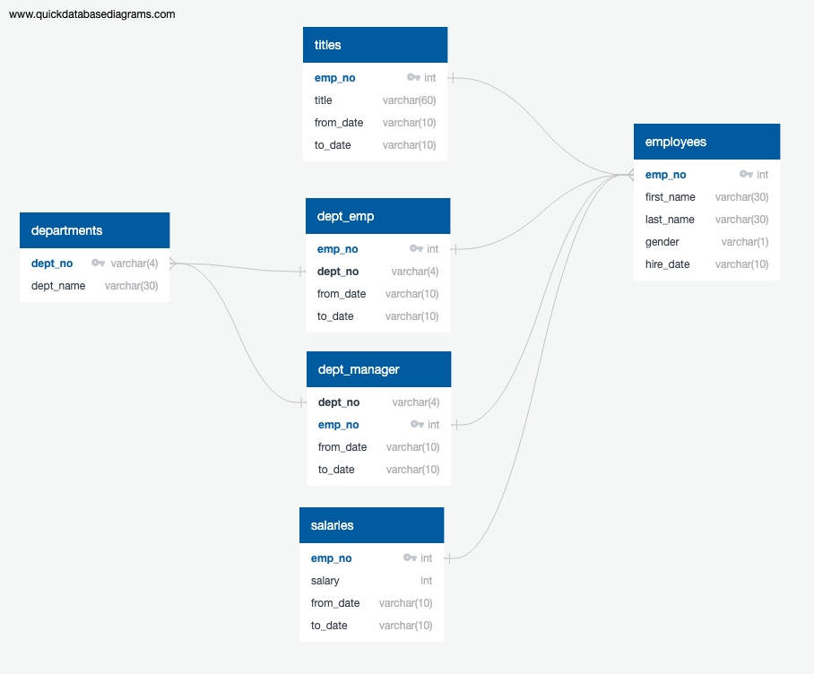

# SQL Challenge
## Goals
The goal of this project is to practice:
1. Data Modeling
2. Data Engineering
3. Data Analysis
by importing given csv files of employee data into an SQL database and sorting through some relevant data.

## Data Modeling
Looking at the headings for the csv files, I saw that unique employees and departments were identified with "emp_no" and "dept_no" respectively. Before creating the database, I wanted to make a schematic for what data is represented and how each table would be connected.

Using QuickDBD, I created the following:

## Data Engineering

## Data Analysis